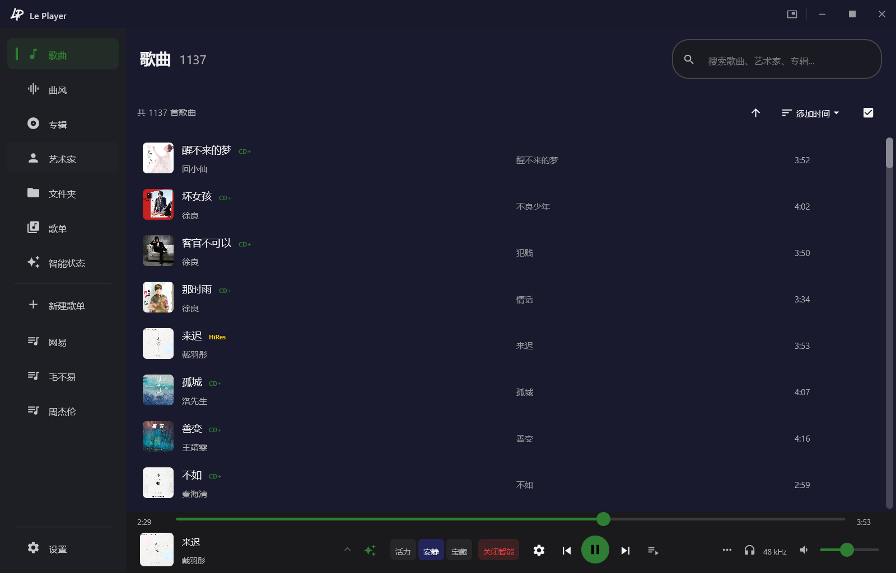

# LePlayer

**以前用流媒体，后来开始自己存歌。**
**世界正在被算法趋同，我的喜欢拒绝同步。**
你的音乐，只属于你。

为听感而生的 Windows 桌面音乐播放器
Kotlin × Rust 双引擎 · WASAPI 独占 bit-perfect 输出 · 源率直出 · 全格式 HiFi 解码

[🌐 在线预览](https://leplayer-studio.github.io/LePlayer/) · [核心特性](#核心特性--highlights) · [双引擎架构](#双引擎架构--dual-engine) · [下载安装](#下载安装--download)

---

## 为什么选 LePlayer？ / Why LePlayer?

- **bit-perfect 输出** — WASAPI 独占模式直通声卡，采样率自适应，源率直出零重采样损失
  - *bit-perfect output* — WASAPI exclusive mode feeds the DAC directly; auto sample-rate adaptation with source-rate-direct, zero resampling loss
- **Rust 原生引擎** — 原生音频底层 + 环形缓冲 + 欠载淡出保护，长时间播放稳定可靠
  - *Rust native engine* — native audio layer with ring buffer + underflow fade, stable for long sessions
- **原生 UI** — Compose Desktop + Material 3 原生渲染；深浅主题、动态取色、桌面歌词、迷你播放器一应俱全
  - *Native UI* — Compose Desktop + Material 3; light/dark themes, dynamic color, desktop lyrics, mini-player
- **专业音频管线** — 高质量重采样、严格背压控制、解码与输出解耦，听感经得起推敲
  - *Pro audio pipeline* — high-quality resampling, strict back-pressure, decode/output decoupled

## ✨ 核心特性 / Highlights

### 🔊 音频引擎 / Audio Engine

| 能力 | 说明 |
|---|---|
| WASAPI 双模式 | 共享模式（系统混音）+ 独占模式（bit-perfect） |
| ASIO 输出 | 专业低延迟音频接口，支持原生 DSD 直出 |
| 采样率自适应 | 自动检测设备原生采样率；支持源率直出（跳过重采样，零音质损失） |
| 高质量重采样 | 高精度 SRC 算法，防过冲削波 |
| 预填充启动 | 启动 / 切歌先填满缓冲再开流，消除空缓冲欠载 |
| 背压控制 | 写入速率严格跟随播放速率，节奏不受 GC 干扰 |
| Rust 底层引擎 | 原生音频输出，缓冲管理与欠载淡入淡出保护 |
| ASIO 原生 DSD | 支持 ASIO 原生 DSD 模式，DSD64/128/256 直出 DAC |
| CUE 分轨解析 | 整轨音频自动拆分，独立曲目入库 |

### 🖥️ 界面交互 / UI & Interaction

- **Material 3 原生 UI** — 深浅主题 + 云母/烟雾材质，Compose Desktop 原生渲染，不是套壳网页
- **全局菜单统一** — 右键菜单 / 下拉 / 展开面板同款圆角描边，视觉一致
- **全局 UI 缩放** — 80%–150% 滑块无级缩放；进入全屏自动放大，4K 大屏友好
- **系统媒体控制（SMTC）** — 任务栏 / 锁屏 / 蓝牙耳机按键可控制播放，显示封面与进度
- **全局键盘快捷键** — 播放 / 暂停 / 切歌 / 音量 / 收藏，可自定义
- **桌面歌词 + 迷你播放器** — 独立歌词窗口与迷你模式，支持锁定穿透、显示下一行、单句偏移校准
- **系统托盘集成** — 托盘图标随主题切换，托盘菜单快捷操作
- **智能歌单** — 多条件组合筛选，自动生成动态歌单
- **全局字体统一** — 字号 / 字重 / 行高收口设计 token，全局一致

### 🗂️ 数据管理 / Library

- **全量音乐库索引** — 歌曲 / 歌单 / 艺术家 / 专辑 / 播放历史
- **文件去重** — 基于内容哈希识别，重复文件不入库
- **增量扫描** — 万曲级音乐库高效增量更新
- **文件夹黑名单** — 扫库时排除录音 / 铃声等无关目录
- **封面缓存** — 异步加载，内存 / 磁盘两级缓存
- **内置标签编辑** — 右键直接改标题 / 艺术家 / 专辑 / 年份 / 流派，写回文件元数据
- **封面编辑** — 单首歌右键直接替换封面
- **歌词校准** — 全局 + 单首歌双重偏移校准
- **音质分析** — 码率初筛 + 高频截止提示，辅助识别转码音源

## 🎨 图标与主题 / Icons & Themes

默认桌面图标采用清新的**绿色渐变**版本：

- **绿色版**为当前默认桌面图标
- **深色版**适配深色主题；任务栏与系统托盘图标随主题自动切换

## 🏗️ 双引擎架构 / Dual-Engine

| 层 | 职责 |
|---|---|
| 🎨 Kotlin · 应用层 | Compose Desktop + Material 3 原生渲染 UI：音乐库 / 歌单 / 播放页 / 设置，深浅主题、动态取色、桌面歌词、迷你播放器、系统托盘 |
| 🦀 Rust · 音频引擎 | 原生音频输出层：WASAPI 共享 / 独占双模式、ASIO 低延迟接口、原生 DSD 直出、缓冲管理与欠载保护、全格式 HiFi 解码，为听感提供底层保障 |

Kotlin 与 Rust 各展所长——UI 用 Kotlin 快速迭代，音频链路用 Rust 守住稳定与音质。

## 🎧 听感保障 / Fidelity Guarantees

- **节奏稳定** — 播放节奏不受内存回收影响，长时间聆听不漂移、不卡顿
- **防爆音** — 缓冲水位实时监控，异常时自动淡入淡出，杜绝爆音与断裂
- **零损失输出** — 设备支持时直接以文件原始采样率输出，跳过重采样环节

## 📥 下载安装 / Download

> 当前仅发布 **Windows** 版本。

- **安装包**：[`LePlayer-Setup.exe`](https://github.com/LePlayer-Studio/LePlayer/releases/latest/download/LePlayer-Setup.exe)
  （最新版自动指向，无需手动更新）
- **当前版本**：v1.6.4 · 约 102 MB
- **SHA-256**：`bf2f4889217a6d8c67ee17613ff9c948cc7b56092bec7ff1c9a519818b5434e1`
- **平台**：Windows x64（内置运行时，无需预装 Java 环境）

**安装 / Install**

1. 下载 `LePlayer-Setup-1.6.4.exe`
2. 右键 → **以管理员身份运行**（标准用户会弹出 UAC）
3. 跟随向导完成安装，首次启动会引导选择音乐文件夹

升级安装会保留原有音乐库与设置。 / Upgrading keeps your existing library and settings.

## 🆕 v1.6.4 更新要点 / What's New

### 新增
- **系统媒体控制（SMTC）** — 任务栏 / 锁屏 / 蓝牙耳机按键控制播放，显示封面与进度
- **全局键盘快捷键** — 播放 / 暂停 / 切歌 / 音量 / 收藏
- **全局 UI 缩放** — 80%–150% 滑块；全屏自动放大，4K 大屏友好
- **文件夹黑名单** — 扫库排除录音 / 铃声等无关目录
- **内置标签编辑** — 右键改标题 / 艺术家 / 专辑 / 年份 / 流派，写回文件
- **桌面歌词显示下一行** — 提前预览下一句
- **音质分析** — 码率初筛 + 高频截止提示
- **首次启动引导** — 打开即引导选择音乐文件夹

### 优化
- 所有菜单 / 下拉 / 展开面板统一为同款圆角描边
- 二级弹窗与主界面材质融合，不再割裂
- 全局字号 / 字重 / 行高收口为设计 token
- 安装包带完整版本资源，右键属性可见版本号

### 修复
- DSD 播放周期性爆音（ASIO 回调线程阻塞）
- 切歌后设备枚举刷新卡顿
- 歌词 / 元数据联网补全静默执行，不打断使用

## 🗺️ Roadmap

- [x] v1.6.4 — SMTC · 全局快捷键 · UI 缩放 · 标签编辑 · 文件夹黑名单
- [x] v1.6.3 — 原生 DSD · CUE 分轨 · 字体统一 · 弹窗协调
- [x] v1.6.0–v1.6.2 — 收件箱拖放 · 歌词校准 · 桌面歌词锁定 · 瘦身
- [ ] 单曲频谱分析（识别转码音源）
- [ ] macOS / Linux 打包发布
- [ ] 更多主题与图标自定义

## 📄 许可证 / License

本软件为闭源专有软件，保留所有权利（All Rights Reserved）。
音频能力基于 **FFmpeg** 构建（LGPL v2.1），随安装包提供第三方组件许可证全文与声明：

- 安装后位置：`<安装目录>\app\resources\THIRD_PARTY_NOTICES.md`
- 许可证全文：`<安装目录>\app\resources\licenses\`

## 🤝 反馈支持 / Feedback

使用中遇到问题或有好想法，欢迎前往 [Issues](https://github.com/LePlayer-Studio/LePlayer/issues) 反馈，附上问题描述与复现步骤即可。

---

**如果 LePlayer 对你有用，欢迎 Star ⭐ 支持**

Made with Kotlin & Rust

