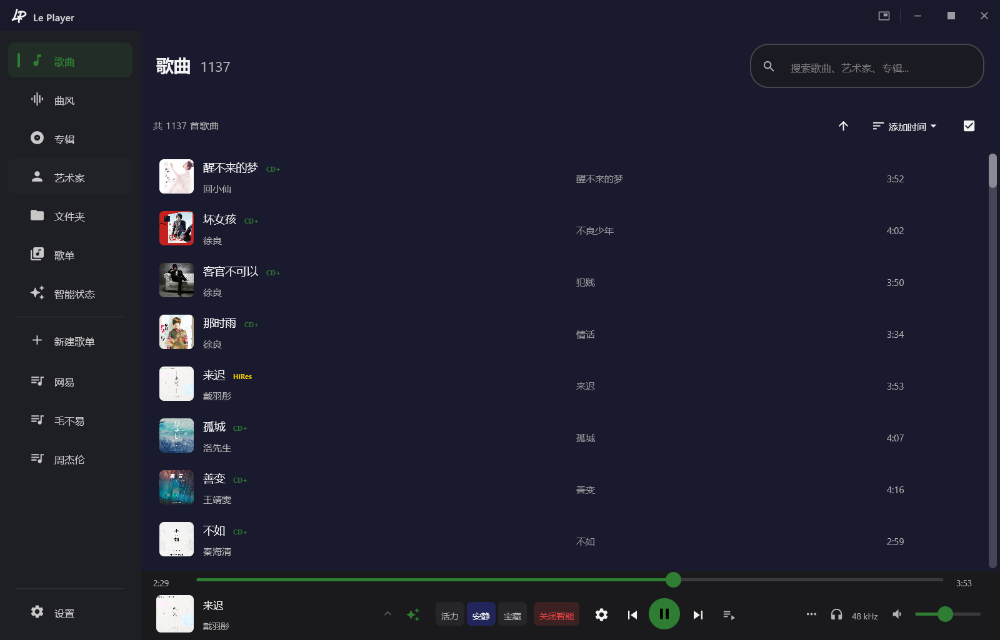



# LePlayer

**以前用流媒体，后来开始自己存歌。**
**世界正在被算法趋同，我的喜欢拒绝同步。**
你的音乐，只属于你。

为听感而生的 Windows 桌面音乐播放器
Kotlin × Rust 双引擎 · WASAPI 共享 / 独占 / ASIO 三后端 · 源率直出 bit-perfect · 全格式 HiFi 解码

-brightgreen)

[🛒 微软商店（最新版）](https://apps.microsoft.com/detail/9PDTB5PT4VR7) · [⬇️ GitHub 安装版 v1.6.6](https://github.com/LePlayer-Studio/LePlayer/releases/download/v1.6.6/LePlayer-Setup-1.6.6.exe) · [🌐 在线预览](https://leplayer-studio.github.io/LePlayer/) · [使用指南](https://leplayer-studio.github.io/LePlayer/guide.html)

---

> ## 📢 分发渠道说明 / Distribution
>
> - **最新版本在微软商店发布**：**v1.6.7 及以后版本仅通过 [Microsoft Store](https://apps.microsoft.com/detail/9PDTB5PT4VR7) 提供更新（买断制，一次购买永久使用）。**
> - **GitHub 最后一个安装包为 v1.6.6**：本页提供的 `LePlayer-Setup-1.6.6.exe` 是 GitHub 渠道的最终安装版，可免费下载使用，之后不再在 GitHub 上传新的安装包。
> - **GitHub 之后只保留更新记录**：新版本的功能与修复说明仍会在此页面与[更新日志](#-更新日志--changelog)持续更新，但安装包请前往微软商店获取。
>
> Latest version (v1.6.7+) is delivered exclusively through the Microsoft Store. The last GitHub installer is v1.6.6; this repository keeps release notes only afterwards.

---

## 为什么选 LePlayer？ / Why LePlayer?

- **bit-perfect 输出** — WASAPI 独占 / ASIO 直通声卡，采样率自适应，源率直出零重采样损失
  - *bit-perfect output* — WASAPI exclusive / ASIO feed the DAC directly; auto sample-rate adaptation with source-rate-direct, zero resampling loss
- **Rust 原生引擎** — 原生音频底层 + 环形缓冲 + Pull 拉取式链路 + 欠载淡出保护，长时间播放稳定可靠
  - *Rust native engine* — native audio layer, ring buffer, pull-model callback and underflow fade, stable for long sessions
- **原生 UI** — Compose Desktop + Material 3 原生渲染；深浅主题、云母/烟雾材质、动态取色、桌面歌词、迷你播放器一应俱全
  - *Native UI* — Compose Desktop + Material 3; light/dark themes, Mica/Smoke, dynamic color, desktop lyrics, mini-player
- **专业音频管线** — Kaiser 窗高质量重采样、严格背压控制、解码与输出解耦，听感经得起推敲
  - *Pro audio pipeline* — Kaiser-window resampling, strict back-pressure, decode/output decoupled

## ✨ 核心特性 / Highlights

### 🔊 音频引擎 / Audio Engine

| 能力 | 说明 |
|---|---|
| WASAPI 双模式 | 共享模式（系统混音）+ 独占模式（bit-perfect） |
| ASIO 输出 | 专业低延迟音频接口，支持原生 DSD 直出 |
| 原生 DSD | ASIO 原生 DSD / DoP，DSD64 / DSD128 / DSD256 直出 DAC |
| 采样率自适应 | 自动检测设备原生采样率；支持源率直出（跳过重采样，零音质损失） |
| 高质量重采样 | Kaiser β=8 高精度 SRC，防过冲削波，统一钳位监控 |
| Pull 拉取式链路 | Rust 音频线程按硬件时钟主动拉数，单解码线程 + 环形缓冲，零欠载、不漂移 |
| 预填充 / 预热启动 | 启动、切歌先填满缓冲再开流；独占能力后台预热，首播不再长时间等待 |
| 背压控制 | 写入速率严格跟随播放速率，节奏不受 GC 干扰 |
| 三级容错 | 位深不支持自动回退，原生层异常降级 JavaSound，保证总能出声 |
| CUE 分轨解析 | 整轨音频自动拆分，独立曲目入库并正确定位整轨文件 |
| 设备热切换 | 播放中切换后端 / 设备不重头、不爆音；设备断开自动暂停 |

### 🖥️ 界面交互 / UI & Interaction

- **Material 3 原生 UI** — 深浅主题 + 云母 / 烟雾原生材质，Compose Desktop 原生渲染，不是套壳网页
- **全局右键菜单** — 播放 / 下一首 / 收藏 / 编辑标签 / 替换封面 / 歌词校准 / 打开文件位置 / 删除到回收站，曲库、专辑、艺术家、歌单、收件箱各处一致
- **桌面歌词 + 迷你播放器** — 独立歌词窗口与迷你模式，支持锁定全穿透、单句偏移校准、显示下一行、独立字体设置
- **Windows SMTC 系统集成** — 任务栏、锁屏、蓝牙耳机 / 键盘媒体键原生控制，播放时阻止屏保
- **全局键盘快捷键** — 播放 / 暂停 / 切歌 / 音量 / 桌面歌词，后台也能控制，支持自定义
- **全局 UI 缩放** — 80%–150% 滑块，4K / 大屏友好；全屏自动放大界面
- **全局字体** — 随包 MiSans、系统字体（雅黑 / 等线等）与自定义字体文件，全局 / 页面歌词 / 桌面歌词可分别设置
- **系统托盘集成** — 托盘图标随主题切换，托盘菜单快捷操作（含歌词锁定开关）
- **智能歌单** — 多条件组合筛选，自动生成动态歌单；支持自定义曲风分组
- **页面缓存 / 滚动记忆** — 各列表独立滚动条，进入专辑 / 歌单再返回保持原位置

### 🗂️ 数据管理 / Library

- **全量音乐库索引** — 歌曲 / 歌单 / 艺术家 / 专辑 / 流派 / 播放历史
- **本地 / NAS / 外置盘一视同仁** — 只认库根路径，挂载的网络盘与本机磁盘走同一套扫描逻辑
- **文件去重** — 基于内容哈希识别，重复文件不入库
- **增量扫描** — 按修改时间 + 大小 + 解析版本判定，万曲级音乐库高效更新；手动刷新即时执行
- **文件夹黑名单 + 短片段过滤** — 扫库可排除指定目录，并自动跳过短于 30 秒的录音 / 铃声片段
- **内置标签编辑** — 右键直接修改标题 / 艺术家 / 专辑并写回文件，支持 APE 等格式，曲库各处可触发
- **删除进回收站** — 删除歌曲先进软件内回收站并提示，可查看歌名 / 艺术家 / 专辑、可恢复；确认清理走系统回收站，仍可还原，不直接永久删除
- **封面缓存** — 源端按显示尺寸降采样解码，内存 / 磁盘两级加权缓存，快速滑动不卡顿、不爆内存
- **歌词校准** — 全局 + 单首歌双重偏移校准；在线歌词与翻译静默匹配
- **音质分析入口** — 按码率给出初筛提示，可进一步按需检查频谱

## 🎨 图标与主题 / Icons & Themes

默认桌面图标采用清新的**绿色渐变**版本：

- **绿色版**为当前默认桌面图标
- 深色模式下任务栏与系统托盘图标随主题自动切换

## 🏗️ 双引擎架构 / Dual-Engine

| 层 | 职责 |
|---|---|
| 🎨 Kotlin · 应用层 | Compose Desktop + Material 3 原生渲染 UI：音乐库 / 歌单 / 播放页 / 设置，深浅主题、动态取色、桌面歌词、迷你播放器、系统托盘、SMTC 集成 |
| 🦀 Rust · 音频引擎 | 原生音频输出层：WASAPI 共享 / 独占双模式、ASIO 低延迟接口、原生 DSD / DoP 直出、Pull 拉取式链路、环形缓冲与欠载保护、全格式 HiFi 解码，为听感提供底层保障 |

Kotlin 与 Rust 各展所长——UI 用 Kotlin 快速迭代，音频链路用 Rust 守住稳定与音质。

## 🎧 听感保障 / Fidelity Guarantees

- **节奏稳定** — Pull 模型以硬件时钟为绝对时基，播放节奏不受内存回收影响，长时间聆听不漂移、不卡顿
- **防爆音** — 缓冲水位实时监控，异常时自动淡入淡出，重采样过冲统一钳位，杜绝爆音与断裂
- **零损失输出** — 设备支持时直接以文件原始采样率 / 位深输出，跳过重采样环节

## 📥 下载安装 / Download

> 当前仅发布 **Windows x64** 版本，内置运行时，**无需预装 Java 环境**。

### 🛒 方式一：微软商店（推荐，最新版 v1.6.7）

- 在 Microsoft Store 搜索 **「LePlayer」**，或点击 [商店页面](https://apps.microsoft.com/detail/9PDTB5PT4VR7)
- 买断制，一次购买永久使用，后续自动更新
- 支持 Windows 10 2004（build 19041）及以上 / Windows 11

### ⬇️ 方式二：GitHub 安装包（最终版 v1.6.6，免费）

- 下载 [`LePlayer-Setup-1.6.6.exe`](https://github.com/LePlayer-Studio/LePlayer/releases/download/v1.6.6/LePlayer-Setup-1.6.6.exe)（约 102 MB）
- 历史版本见 [Releases](https://github.com/LePlayer-Studio/LePlayer/releases)；**v1.6.6 之后 GitHub 不再更新安装包**

**安装 / Install**

1. 下载安装包
2. 右键 → **以管理员身份运行**（标准用户会弹出 UAC）
3. 跟随向导完成安装（NSIS 版可自选安装目录与缓存目录）

升级安装会保留原有音乐库与设置。 / Upgrading keeps your existing library and settings.

> **商店版提示**：微软商店（MSIX）版由系统沙箱管理，**缓存 / 数据目录使用系统分配位置，不支持自定义到其他盘或文件夹**；如需自定义缓存目录，请使用 GitHub 的 NSIS 安装版。

## 🆕 更新日志 / Changelog

### v1.6.7 — 微软商店版（仅商店发布）

- 修复商店容器（MSIX 沙箱）内启动即崩溃的问题，商店版联网改为兼容沙箱的网络栈
- 修复部分设备封面在非开发环境静默不显示的发布阻断问题
- 多位艺术家正确拆分与建档（合唱曲显示全部艺术家，不再只显示第一个）
- 手动刷新文件夹即时执行，不再被自动扫描防抖静默吞掉
- 清单声明兼容 Windows 10 2004 及以上 / Windows 11 24H2；通过本地 WACK 认证自测

### v1.6.6 — GitHub 最终安装版

- **删除保护重做**：删除歌曲进入软件内回收站并弹出提示，可查看与恢复；确认清理走系统回收站，仍可还原
- **内置标签编辑**：右键改标题 / 艺术家 / 专辑并写回文件，曲库 / 专辑 / 艺术家 / 歌单 / 收件箱全入口打通，补充 APE 格式支持
- **Windows SMTC**：任务栏 / 锁屏 / 蓝牙耳机 / 媒体键原生控制
- **全局键盘快捷键**：可自定义，后台也能控制
- **全局 UI 缩放 80%–150%** + 全屏自动放大，4K / 大屏友好
- **全局 / 页面 / 桌面歌词字体**分别可调，随包 MiSans + 系统字体 + 自定义字体
- **文件夹黑名单 + 短片段过滤**：排除指定目录、自动跳过 30 秒内录音 / 铃声
- **设备断开自动暂停**、页面缓存与滚动位置记忆
- 封面源端降采样 + 加权缓存，修复列表快速滑动时内存溢出崩溃
- 修复「打开文件位置」始终跳到文档目录的问题，现正确定位并选中文件（CUE 分轨定位整轨）
- 专辑页「全部播放」直接开始播放；独占模式首播预热，缩短起播等待
- 在线歌词与翻译、在线元数据 / 封面补全静默生效
- NSIS 安装 / 卸载体验修复（文件关联、卸载残留、运行中检测、缓存清理等）

### v1.6.5

- 新增全局 UI 缩放、全屏自动放大、全局键盘快捷键、SMTC、文件夹黑名单、内置标签编辑、桌面歌词下一行、音质分析入口
- 微软商店打包与上架准备（MSIX）
- 字体与多语言相关修复

### v1.6.4

- 修复 DSD 播放周期性爆音（ASIO 回调线程阻塞，半缓冲从 11.6ms 提到 46.4ms）
- 修复 TOPPING DAC 在共享 / 独占设备列表中消失（设备并集枚举）
- 菜单双层圆角、弹窗与主界面材质统一；DLL 自动同步，避免旧 DLL 静默错配
- ASIO 设备枚举改为冷启动预加载 + 后台无感刷新

### 更早版本

- v1.6.0–v1.6.3：原生 DSD / DoP、CUE 分轨、封面编辑、收件箱拖放、歌词校准、桌面歌词锁定、安装包瘦身
- v1.5.x：设置持久化、全局快捷键、任务栏图标随主题、单实例保护、大曲库扫描性能

完整历史见 [Releases](https://github.com/LePlayer-Studio/LePlayer/releases)。

## 🗺️ Roadmap

- [x] v1.6.7 — 微软商店上架（商店渠道分发、买断制）
- [x] v1.6.6 — 删除回收站 · 内置标签编辑 · SMTC · 全局快捷键 · UI 缩放 · 字体体系
- [x] v1.6.4–v1.6.5 — DSD 爆音修复 · 设备枚举 · MSIX 打包
- [x] v1.6.0–v1.6.3 — 三后端 · 原生 DSD · CUE 分轨 · 封面编辑
- [ ] 按需频谱分析（假无损检测）增强
- [ ] 车载模式与移动端调研
- [ ] 更多主题与界面自定义

## 📄 许可证 / License

本软件为闭源专有软件，保留所有权利（All Rights Reserved）。
音频能力基于 **FFmpeg** 构建（LGPL v2.1），随安装包提供第三方组件许可证全文与声明：

- 安装后位置：`<安装目录>\app\resources\THIRD_PARTY_NOTICES.md`
- 许可证全文：`<安装目录>\app\resources\licenses\`

隐私政策见 [PRIVACY.md](PRIVACY.md)。

## 🤝 反馈支持 / Feedback

使用中遇到问题或有好想法，欢迎前往 [Issues](https://github.com/LePlayer-Studio/LePlayer/issues) 反馈，附上问题描述与复现步骤即可。

---

**如果 LePlayer 对你有用，欢迎 Star ⭐ 支持**

Made with Kotlin & Rust

